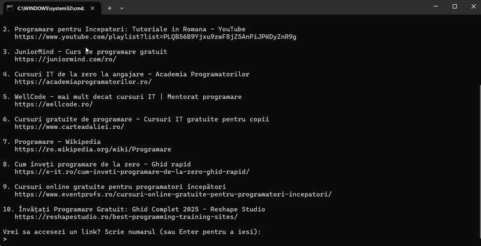

# Go2Web - HTTP over TCP Sockets

CLI tool for Lab 5 that performs HTTP/HTTPS requests directly over TCP sockets.

## Lab Requirements Covered

- `go2web -h` shows help
- `go2web -u <URL>` makes an HTTP request and prints a human-readable response
- `go2web -s <search-term>` searches and prints top results
- HTML responses are converted to readable text

## Extra Features Implemented

- HTTP redirects (`301`, `302`, `303`, `307`, `308`)
- In-memory cache for repeated requests
- Content negotiation and handling for both HTML and JSON
- Chunked transfer decoding
- Interactive opening of search results by index
- Graceful handling for short URLs such as `google` (tries `https://google.com`, `https://www.google.com`)

## Tech Stack

- Python 3
- Raw TCP sockets (`socket`)
- TLS for HTTPS (`ssl`)
- Standard library parsers/utilities (`urllib.parse`, `json`, `re`)

## Project Structure

- `go2web.py` - main CLI application
- `go2web.bat` - launcher script (Windows)
- `cache/` - optional folder reserved for cache-related artifacts

## How To Run

From project folder:

```bash
go2web -h
go2web -u https://example.com
go2web -u google
go2web -s network programming
```

If `go2web` is not available in PATH, use:

```bash
python go2web.py -h
python go2web.py -u https://example.com
python go2web.py -s network programming
```

## CLI Help

```text
go2web - HTTP over TCP Sockets
================================
Usage:
  go2web -u <URL>          Make an HTTP request to URL and print response
  go2web -s <search-term>  Search and print top results
  go2web -h                Show help
```

## Search Behavior

- Uses DuckDuckGo HTML endpoint (`https://html.duckduckgo.com/html/?q=...`)
- Extracts top results from HTML
- Prints title + link
- Allows opening a result directly from CLI

## Results




## Notes

- No GUI is used (CLI only)
- HTTP requests are manually constructed and sent over sockets
- Designed to align with Lab 5 grading criteria
